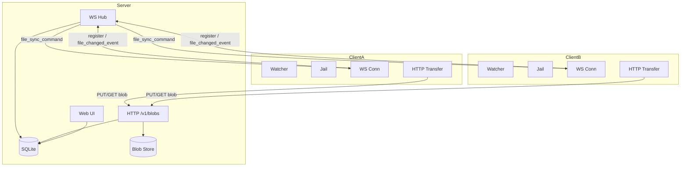

# Axion

Axion はサーバー集約型のファイル同期ツールです。サーバーが SQLite と blob ストレージで変更を管理し、複数クライアントが WebSocket で接続してフォルダを双方向または片方向に同期します。Web UI でリアルタイムのステータス確認が可能です。

## インストール

```bash
go install github.com/HMasataka/axion/cmd/axion@latest
```

## クイックスタート

### サーバー起動

```bash
# PSK (Pre-Shared Key) を作成
mkdir -p ~/.config/axion
echo "your-secret" > ~/.config/axion/server.token

# サーバーを起動
axion server
```

### クライアント起動

```bash
cd /path/to/sync
axion client --server ws://server-host:8765
```

### Web UI

ブラウザで `http://server-host:8765` にアクセスします。`--admin-user` / `--admin-password` を指定した場合は HTTP Basic 認証が要求されます。

## CLI リファレンス

### `axion server`

```text
Usage: axion server [flags]

Flags:
  --bind            string   address to bind (default "127.0.0.1:8765")
  --data-dir        string   directory for sqlite db and blob storage
  --admin-user      string   Basic auth user for Web UI
  --admin-password  string   Basic auth password for Web UI
  --psk-file        string   file containing pre-shared key for client auth
```

### `axion client`

```text
Usage: axion client [flags]

Flags:
  --server    string   axion server URL (default "ws://127.0.0.1:8765")
  --root      string   root directory to sync (default: current directory)
  --id-file   string   file storing client UUID
  --psk-file  string   file containing pre-shared key
```

## アーキテクチャ



## 同期セマンティクス

### 双方向同期 (bidirectional)

- LWW (Last-Write-Wins) をサーバー時刻で判定します
- 同一ファイルが両クライアントで同時更新された場合、古い側のファイルを `<name>.conflict-<short>-<ns>` へ退避してから新しい版を適用します

### 片方向同期 (a_to_b / b_to_a)

- ソース側の状態をデスティネーション側へ厳密に鏡映します
- デスティネーション側の独自変更は上書きされます

## セキュリティ

| 対象                 | 方法                                                 |
| -------------------- | ---------------------------------------------------- |
| クライアント認証     | PSK (Bearer トークン)                                |
| Web UI 認証          | HTTP Basic 認証                                      |
| ファイルアクセス制限 | root jail (クライアント側)                           |
| 通信暗号化           | 外部 reverse proxy (nginx / caddy) で TLS を終端する |

TLS は Axion 自体では終端しません。本番環境では reverse proxy を配置してください。詳細は [PROTOCOL.md](docs/PROTOCOL.md) の「Reverse Proxy 推奨設定」を参照してください。

## 制約・既知のギャップ

- 3 クライアント以上の同期は v0.3 以降で対応予定
- 直接 P2P 転送は v0.3 以降で対応予定
- マルチユーザーは v0.3 以降で対応予定
- Windows は best-effort 対応であり、テスト未実施です

## 設定ファイル

設定ファイルは `~/.config/axion/` に置きます。

| ファイル       | 説明                                                           |
| -------------- | -------------------------------------------------------------- |
| `server.token` | クライアント認証用 PSK。サーバー・クライアント共通で参照します |
| `client.id`    | クライアントを識別する UUIDv4。初回起動時に自動生成されます    |

## 開発

```bash
# 単体テスト
go test ./...

# 統合テスト
go test -tags integration ./internal/integration_test/...

# リリースビルド (CGO_ENABLED=0)
CGO_ENABLED=0 go build -ldflags='-s -w' -o ./bin/axion ./cmd/axion
```
