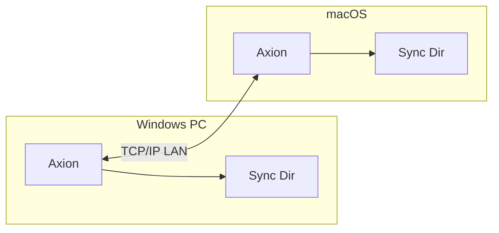
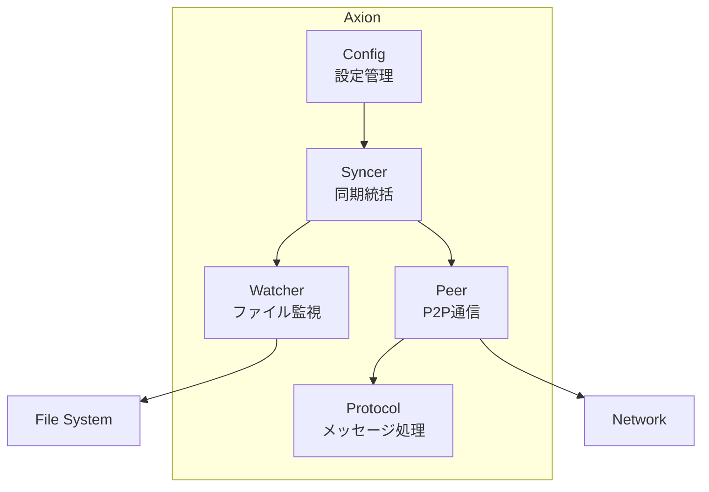
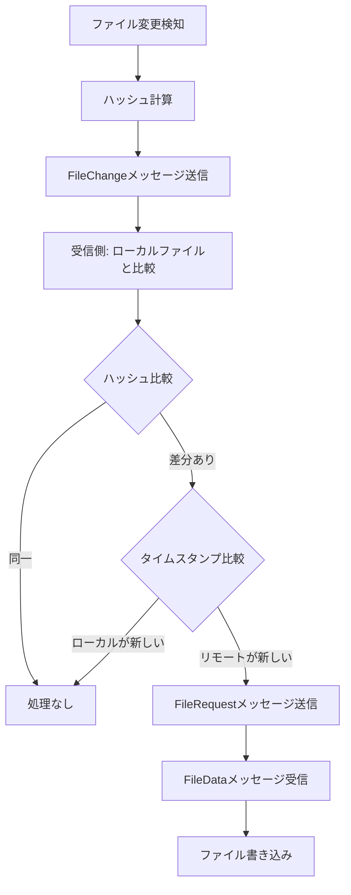

# Axion - クロスプラットフォームファイル同期ツール仕様書

## 1. 概要

Axionは、同一LAN内にあるWindows/macOS間で特定フォルダのファイルを双方向同期するためのツールです。

### 1.1 目的

- WindowsとmacOS間でファイルをリアルタイムに同期
- シンプルな設定で利用可能
- 外部サービスに依存しないP2P方式

### 1.2 前提条件

- 同期対象のマシンは同一LAN内に接続されている
- 相手のローカルIPアドレスは既知である
- 指定ポート（デフォルト: 8765）での通信が許可されている

## 2. システム構成

### 2.1 アーキテクチャ



### 2.2 コンポーネント構成



## 3. 機能仕様

### 3.1 ファイル監視

- ファイルシステムイベントをリアルタイムで検知
- 対応イベント:
  - 作成 (Create)
  - 更新 (Write)
  - 削除 (Remove)
  - リネーム (Rename)
- デバウンス処理（100ms）により連続イベントを集約
- 再帰的なディレクトリ監視

### 3.2 ファイル同期

#### 同期トリガー

1. **リアルタイム同期**: ローカルファイル変更時に即座に通知
2. **初期同期**: 起動時に全ファイルの状態を比較・同期

#### 競合解決

- **タイムスタンプベース**: 更新日時が新しいファイルを優先
- **ハッシュ比較**: SHA-256でファイル内容の同一性を確認

#### 同期フロー



### 3.3 通信プロトコル

#### メッセージ形式

```
+-----------------------------------+-----------------------------------+
|  Length (4 bytes, Big Endian)     |  JSON Payload (variable length)   |
+-----------------------------------+-----------------------------------+
```

```json
{
  "type": "<MessageType>",
  "payload": "<Base64 encoded>"
}
```

#### メッセージタイプ

| Type | 名称         | 用途               |
| ---- | ------------ | ------------------ |
| 1    | FileChange   | ファイル変更通知   |
| 2    | FileRequest  | ファイルデータ要求 |
| 3    | FileData     | ファイルデータ送信 |
| 4    | FileDelete   | ファイル削除通知   |
| 5    | SyncRequest  | 初期同期要求       |
| 6    | SyncResponse | 初期同期応答       |
| 7    | Ack          | 確認応答           |

### 3.4 除外パターン

デフォルトで以下のファイル/ディレクトリを除外:

- `.git` - Gitリポジトリ
- `.DS_Store` - macOSメタデータ
- `Thumbs.db` - Windowsサムネイルキャッシュ
- `*.tmp` - 一時ファイル
- `*.swp` - Vimスワップファイル
- `*~` - バックアップファイル

## 4. 設定

### 4.1 設定ファイル

パス: `~/.config/filesync/config.json`

```json
{
  "sync_path": "/Users/username/Sync",
  "listen_addr": ":8765",
  "peer_addrs": ["192.168.1.10:8765"],
  "ignore_list": [".git", ".DS_Store", "Thumbs.db", "*.tmp", "*.swp", "*~"]
}
```

### 4.2 設定項目

| 項目        | 型       | デフォルト | 説明                 |
| ----------- | -------- | ---------- | -------------------- |
| sync_path   | string   | ~/Sync     | 同期対象ディレクトリ |
| listen_addr | string   | :8765      | リッスンアドレス     |
| peer_addrs  | []string | []         | 接続先ピアアドレス   |
| ignore_list | []string | (上記参照) | 除外パターン         |

### 4.3 コマンドラインオプション

```
Usage: axion [options]

Options:
  -path string     同期フォルダのパス
  -listen string   リッスンアドレス (例: :8765)
  -peers string    ピアアドレス (カンマ区切り)
  -config string   設定ファイルパス
  -init            設定ファイルを初期化
  -status          現在の状態を表示して終了
```

## 5. 使用方法

### 5.1 初期セットアップ

#### macOS側

```bash
# 設定ファイルの初期化
axion -init

# 設定ファイルを編集してWindowsのIPを追加
# ~/.config/filesync/config.json
```

#### Windows側

```bash
# 設定ファイルの初期化
axion.exe -init

# 設定ファイルを編集してmacOSのIPを追加
# %USERPROFILE%\.config\filesync\config.json
```

### 5.2 起動

```bash
# 設定ファイルを使用
axion

# コマンドラインで指定
axion -path /path/to/sync -peers 192.168.1.10:8765
```

## 6. クロスプラットフォーム対応

### 6.1 パス変換

- 内部では全てスラッシュ（/）区切りで保持
- Windows: `filepath.FromSlash` / `filepath.ToSlash` で変換

### 6.2 改行コード

- ファイル内容はバイナリとして転送（変換なし）
- 必要に応じてユーザー側で対応

### 6.3 ファイル権限

- Unixパーミッションは転送しない
- ファイル: 0644
- ディレクトリ: 0755

## 7. 制限事項

### 7.1 現在の制限

- シンボリックリンクは非対応
- ファイルロック機能なし
- 暗号化通信は未実装（LAN内使用を前提）
- 大容量ファイルはメモリに全て読み込む

### 7.2 推奨上限

| 項目               | 推奨値             |
| ------------------ | ------------------ |
| 単一ファイルサイズ | 100MB以下          |
| 同期ファイル数     | 10,000ファイル以下 |
| ディレクトリ深度   | 20階層以下         |

## 8. エラーハンドリング

### 8.1 接続エラー

- 自動再接続（5秒間隔）
- 接続失敗時もローカル監視は継続

### 8.2 ファイルエラー

- 読み取り/書き込みエラーはログ出力
- エラー発生ファイルはスキップして継続

## 9. ビルド

### 9.1 必要環境

- Go 1.21以上

### 9.2 ビルドコマンド

```bash
# macOS
go build -o bin/axion ./cmd/filesync

# Windows (クロスコンパイル)
GOOS=windows GOARCH=amd64 go build -o bin/axion.exe ./cmd/filesync
```

## 10. 今後の拡張予定

- [ ] TLS暗号化通信
- [ ] 大容量ファイルのチャンク転送
- [ ] 競合検出とマニュアル解決
- [ ] WebUI/ステータス表示
- [ ] 自動ピア検出（mDNS/Bonjour）
